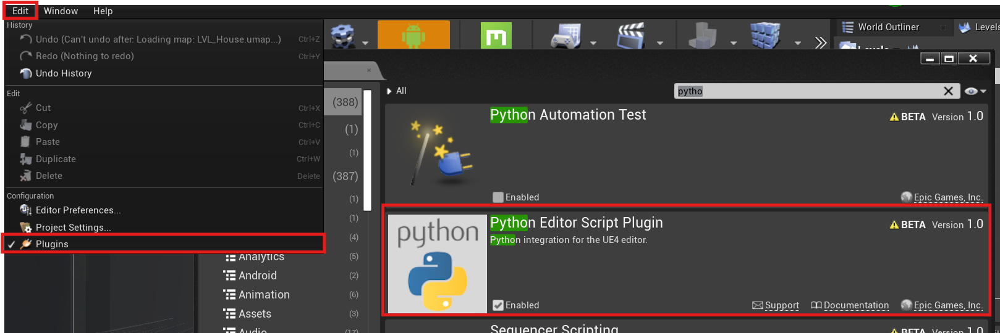
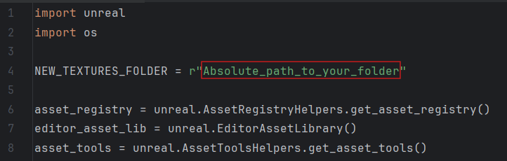
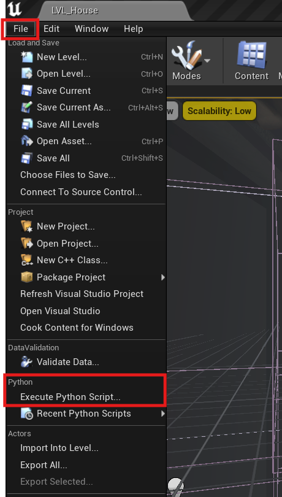

# UE_TexturePath_Updater

✨ Key Features

This tool solves the common problem where source texture files have been moved or replaced on the disk. Instead of manually updating every asset, the script performs the following:

⚡️ Automates the Process: Iterates through all Texture2D assets in your project.

🔍 Name Matching: Searches for a file with an identical name in your specified folder.

🔄 Update & Reimport: When a match is found, it updates the asset's Source File Path and calls the reimport_asset() function to load the new data instantly.

CRITICAL: For successful matching, the file names in your source folder must exactly match the names of the texture assets in Unreal Engine.

⚙️ Requirements

Unreal Engine 4.24 or later.

The Python Editor Script Plugin must be enabled (Edit → Plugins → Scripting).

## 🚀 Usage Guide

### Step 1: Configure the Script Path

Open UE_TexturePath_Updater.py and replace the path in the NEW_TEXTURES_FOLDER variable with the absolute path to your folder containing the new source files:

NEW_TEXTURES_FOLDER = r"Absolute_path_to_your_folder"

# ABSOLUTE PATH to the folder where your new .png, .tga, .jpg, etc., files reside.

### Step 2: Execute in Unreal Engine

Launch your Unreal Engine project.

In the editor menu, navigate to File → Execute Python Script...

Select your UE_TexturePath_Updater.py file.

The script will start processing. Messages regarding successful updates and reimports will be displayed in the Output Log window (Window → Developer Tools → Output Log).
